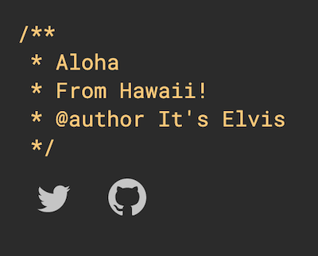

# Mlite UI Components

> This is a UI Component Library which I've started mainly rebuild my [homepage](https://mprieto.me) and to use it in [my blog](https://mprieto.me/blog).

## Install

```bash
npm install --save @jmigueprieto/mlite-ui-components
```

## Usage

```jsx
import React from "react";

import "@jmigueprieto/mlite-ui-components/dist/index.css";
import { Page, Social } from "@jmigueprieto/mlite-ui-components";

const App = () => {
  return (
    <Page>
      <Comment>
        Aloha <br />
        From Hawaii! <br />
        @author It's Elvis <br />
      </Comment>
      <Social type="twitter" href="https://twitter.com/miguelprieto" />
      <Social type="github" href="https://github.com/jmigueprieto" />
    </Page>
  );
};

export default App;
```



## Updates

**2020-07-26**

Just getting started. I'm mostly trying the setup of things

I started the project using [create-react-library](https://github.com/transitive-bullshit/create-react-library). It's pretty cool.

Added a few components, storybook and other stuff to it.

## License

MIT © [jmigueprieto](https://github.com/jmigueprieto)
